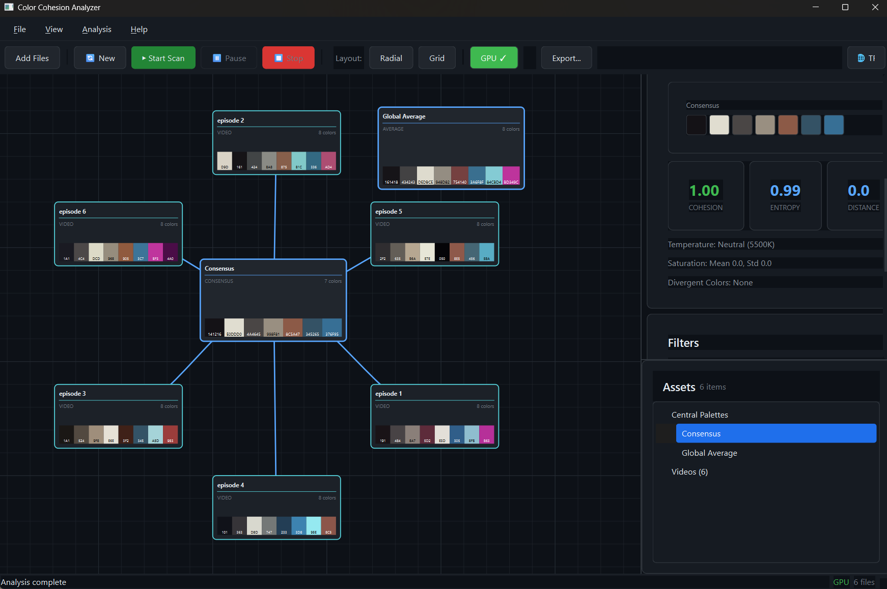
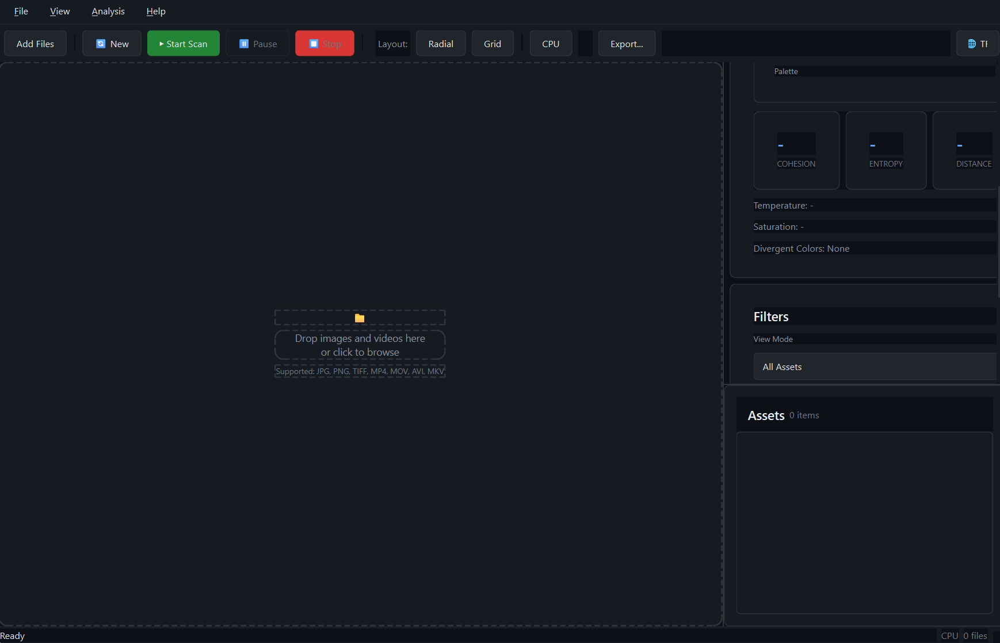
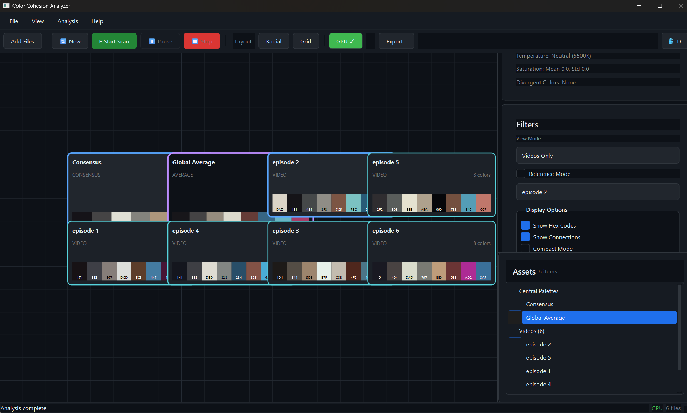

# Color Cohesion Analyzer

A professional-grade software tool for analyzing images and videos to extract perceptually accurate color palettes, evaluate color coherence across multiple assets, and present results in a blueprint-style, node-based visual interface.



## Overview

**Color Cohesion Analyzer** is not a simple palette extractor. It's a comprehensive color analysis tool designed to answer:

> *"Do these images and sequences speak the same visual language?"*

Designed for filmmakers and visual artists working with cinematic imagery, video sequences, and visual references.

## Features

### Core Functionality

- **Perceptual Color Processing**: Uses OKLab/CIELAB color spaces for film-aware analysis
- **Three-Center Model**:
  - Global Average Palette (mathematical average)
  - Consensus Palette (perceptually consistent colors across assets)
  - Outlier Detection (divergent colors and assets)

### Video Analysis
- Shot/scene detection
- Per-shot palette extraction
- Configurable frame sampling (Draft/Balanced/Accurate)
- Timeline palette visualization

### Metrics & Cohesion
- DeltaE-based distance calculations
- Palette entropy (color complexity)
- Warm/cool balance analysis
- Saturation distribution
- Cohesion scores per asset
- Conflict mapping

### Blueprint-Style Interface
- Node-based layout with pan/zoom (Radial & Grid views)
- Professional dark mode UI
- Visual connections showing color relationships
- Filters for outliers, videos, references
- **Multi-language support** (English / Türkçe)

### Export Options
- PNG palette swatches
- JSON/CSV reports
- ASE (Adobe Swatch Exchange) files
- Experimental creative LUTs (.cube)

## Screenshots

### Drop Zone - Initial State
Drag and drop your images and videos to start analysis.



### Radial Layout
Visualize color relationships with the consensus palette at center.


### Grid Layout
Compare all palettes side by side in an organized grid.



## Installation

### Prerequisites
- Python 3.9 or higher
- pip package manager

### Setup

1. Clone or download the project
2. Install dependencies:

```bash
cd color_cohesion_analyzer
pip install -r requirements.txt
```

3. Run the application:

```bash
python main.py
```

### Optional: GPU Acceleration

For CUDA-accelerated clustering (NVIDIA GPUs):

```bash
pip install cupy-cuda12x  # For CUDA 12.x
# or
pip install cupy-cuda11x  # For CUDA 11.x
```

## Usage

### Quick Start

1. **Launch** the application: `python main.py`
2. **Add files**: Drag & drop images/videos or use File > Open
3. **Start analysis**: Click "▶ Start Scan" or press Ctrl+Enter
4. **Explore**: Use the node graph to visualize relationships
5. **Export**: File > Export > Export All

### New Analysis
Click the "🔄 New" button or press `Ctrl+N` to clear current analysis and start fresh.

### Language Toggle
Click the "🌐 TR/EN" button to switch between English and Turkish interface.

### Supported Formats

**Images**: JPG, JPEG, PNG, TIFF, TIF, BMP, WebP, EXR

**Videos**: MP4, MOV, AVI, MKV, WebM, MXF, ProRes

### Keyboard Shortcuts

| Key | Action |
|-----|--------|
| Ctrl+O | Open files |
| Ctrl+N | New analysis |
| Ctrl+Enter | Start analysis |
| F | Fit view to content |
| Home | Reset view |
| +/- | Zoom in/out |
| Middle Mouse | Pan |
| Scroll | Zoom |

## Configuration

Settings can be adjusted in `config.py`:

```python
# Color analysis
ANALYSIS_CONFIG.palette_size = 8
ANALYSIS_CONFIG.color_space = ColorSpace.OKLAB
ANALYSIS_CONFIG.deltaE_threshold = 10.0

# Video sampling
ANALYSIS_CONFIG.sampling_mode = SamplingMode.BALANCED
ANALYSIS_CONFIG.shot_detection_threshold = 30.0

# Performance
ANALYSIS_CONFIG.use_gpu = False
ANALYSIS_CONFIG.cache_enabled = True
```

## Project Structure

```
color_cohesion_analyzer/
├── main.py                 # Application entry point
├── config.py               # Configuration settings
├── requirements.txt        # Python dependencies
├── screenshots/            # Application screenshots
│
├── core/                   # Analysis engine
│   ├── color_space.py      # Color conversions (OKLab, CIELAB)
│   ├── palette_extraction.py# Clustering and palette extraction
│   ├── video_processor.py  # Video/shot analysis
│   └── metrics.py          # Cohesion metrics
│
├── ui/                     # User interface
│   ├── main_window.py      # Main application window
│   ├── node_graph.py       # Node-based visualization
│   ├── panels.py           # Sidebar panels
│   ├── translations.py     # Multi-language support (EN/TR)
│   └── theme.py            # Blueprint styling
│
├── export/                 # Export functionality
│   └── exporter.py         # PNG, JSON, ASE, LUT export
│
└── utils/                  # Utilities
    └── cache.py            # Caching and GPU management
```

## Technical Details

### Color Processing Pipeline

```
Input → Decode → Downscale → Sample → 
Convert to OKLab → Cluster (K-Means) → 
Compute Metrics → Cache → UI
```

### Palette Extraction

Uses Mini-Batch K-Means clustering in perceptual color space (OKLab by default) for efficient and accurate palette extraction. Each color includes:
- Hex code
- RGB values
- Lab values
- Dominance percentage

### Video Analysis

1. **Shot Detection**: Frame difference analysis with configurable threshold
2. **Frame Sampling**: Configurable density (Draft/Balanced/Accurate)
3. **Per-Shot Palettes**: Independent color analysis per detected shot
4. **Timeline Generation**: Color evolution visualization

### Metrics Calculated

- **Cohesion Score**: 0-1 measure of alignment with consensus
- **Distance to Consensus**: DeltaE-based perceptual distance
- **Palette Entropy**: Color complexity/dispersion measure
- **Warm/Cool Balance**: -1 (cool) to +1 (warm)
- **Saturation Distribution**: Statistical analysis of chroma values

## Multi-Language Support

The application supports **English** and **Turkish** languages. Click the language toggle button (🌐) in the toolbar to switch between languages instantly - no restart required.

## Contributing

Contributions are welcome! Please read the development guidelines before submitting PRs.

## License

MIT License - See LICENSE file for details.

---

**Color Cohesion Analyzer** - Empowering visual storytellers with color intelligence.
